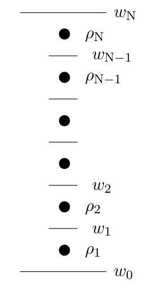
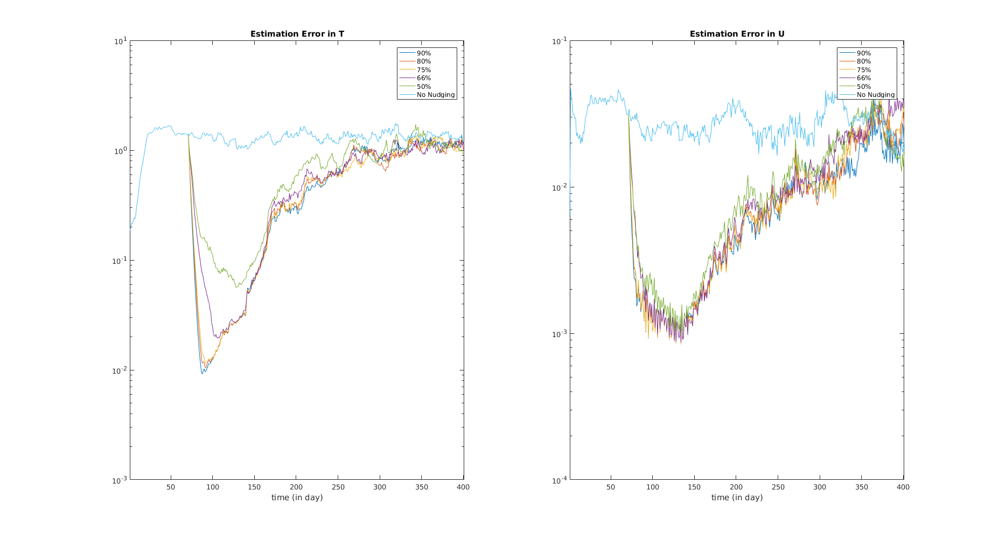

## Introduction to ROMS

### Background
The Regional Ocean Modeling System (ROMS) is a well-designed Fortran package, which simulates the free-surface geophysical fluid dynamics system, using an hydrostatic, primitive equatesiton with Boussinesq approximation. ROMS is developed with the Nonlinear integration kernel which has a wide application in nonlinear fluid dynamic studies.terrain-following vertical coordinate is applied in ROMS, in order to achieve better vertical resolution in shallow water and areas with complex bathymetry.

### Dynamic Equations

The governing dynamical equations of three-dimensional, free-surface, Reynolds-averaged Navier-Stokes equations are (See appendix A for derivation and more details)

$$
\frac{\partial H_zu}{\partial t} + \frac{ \partial (uH_zu)}{\partial x} + \frac{ \partial( v H_z u)}{\partial y}  + \frac{\partial(\Omega H_zu)}{\partial \sigma}  - f H_z v = - \frac{ H_z}{\rho_0}\frac{ \partial p}{\partial x} -   H_z g\frac{ \partial \zeta }{\partial x} - \frac{\partial}{\partial \sigma}(-\frac{K_M}{H_z} \frac{\partial u}{\partial z} - \frac{\nu}{H_z}\frac{\partial u}{\partial \sigma})+F_u+D_u
$$

$$
\frac{\partial H_zv}{\partial t} + \frac{ \partial (uH_zv)}{\partial x} + \frac{ \partial( v H_z v)}{\partial y}  + \frac{\partial(\Omega H_zv)}{\partial \sigma}  + f H_z u = - \frac{ H_z}{\rho_0}\frac{ \partial p}{\partial y} -   H_z g\frac{ \partial \zeta }{\partial y} - \frac{\partial}{\partial \sigma}( -\frac{K_M}{H_z} \frac{\partial v}{\partial z} - \frac{\nu}{H_z}\frac{\partial v}{\partial \sigma})+F_v+D_v
$$

with the continuity equation

$$
\frac{\partial \zeta}{\partial t} + \frac{ \partial (H_zu)}{\partial x} + \frac{ \partial( H_z v)}{\partial y}  + \frac{\partial(H_z \Omega)}{\partial \sigma}  = 0
$$

equation of State

$$
\rho = \rho (T, S, P)
$$
and scalar transport equation for temperature and salinity

$$
\frac{\partial (H_z C)}{\partial t} + \frac{ \partial (u H_z C)}{\partial x} + \frac{ \partial( v H_z C)}{\partial y}  + \frac{\partial(\Omega H_z C)}{\partial \sigma} = -\frac{\partial}{\partial \sigma}( -\frac{K_C}{H_z} \frac{\partial C}{\partial z} - \frac{\nu_\theta}{H_z}\frac{\partial C}{\partial \sigma})
$$

Here, all variables are:

| name                                | Description                             |
| ----------------------------------- | --------------------------------------- |
| $u$                                 | horizontal velocity in x direction      |
| $v$                                 | horizontal velocity in y direction      |
| $\sigma$                            | the scaled sigma coordinate             |
| $\Omega$                            | vertical velocity in (sigma coordinate) |
| $\zeta$                             | free-surface elevation                  |  

| name                                | Description                             |
| ----------------------------------- | --------------------------------------- |
| $H_z$                               | vertical stretching factor              |
| $f$                                 | Coriolis parameter                      |
| $K_M$, $K_C$                        | vertical eddy viscosity and diffusivity |
| $p$                                 | pressure                                |
| $\rho_0$                            | reference density                       |
| $g$                                 | acceleration due to gravity             |
| $C$                                 | tracer (Temperature, Salinity, etc.)    |
| Spatial Discretization (horizontal) | Square Grid                             |
| Spatial Discretization (vertical)   | Terrain Coordinate                      |
| Time Discretization                 | Time Step                               |

In the Navier-Stokes equations, the hydrostatic approximation is used since the horizontal scale is usually larger than the vertical scale thus making the approximation valid. The Boussinesq approximation is also applied here, ignoring the density difference except the terms arisen from the gravity.

### Vertical S-coordinate

In ROMS, the terrain following coordinate system is used in vertical direction, which means that the number of layers for the ocean is the same everywhere while the thickness of each layer varies with the bathymetry of the specific location. There are several options for the transformation equations built in ROMS, controlled by two input argument, Vtransform and Vstretch. For our project, we choose Vtransform = 2 and Vstretch = 4. The details of these two choices will be discussed below.
#### Transformation Equations
Vtransform being 2 means that we are using the formulation developed by A. Shchepetkin in 2005 [1]:

$$
z(x,y,\sigma,t) = \zeta(x,y,t)+[\zeta(x,y,t)+h(x,y)]S(x,y,\sigma)
$$

$$
S(x,y,\sigma) = \frac{h_c\sigma+h(x,y)C(\sigma)}{h_c+h(x,y)}
$$
where $h_c$ is a critical depth controlling the resolution and stretching, which will be desctribed in detail below, $\zeta$ is the free surface elevation, $\sigma$ is a fractional stretching coordinate from $-1\leq\sigma\leq0$ (-1 for the ocean bottom and 0 for the sea surface), and C($\sigma$) is a nondimensinal stretching function ranging from $-1\leq C(\sigma)\leq0$.
It is convenient to define the vertical stretching factor as
$$
H_z\equiv\frac{\partial z}{\partial\sigma}
$$
Then $H_z(x,y,\sigma,t)$ is the vertical grid thickness. In ROMS, it is computed as $\Delta z/\Delta\sigma$.
#### Stretching Functions
(Ref. ROMS Manual)For the option Vstretch = 4, the stretching function is defined as a double stretching function:
Surface refinement function as
$$
C(\sigma) = \frac{1-cosh(\theta_s\sigma)}{cosh(\theta_s)-1}\qquad      for\ \theta_s> 0\\
C(\sigma) = -\sigma^2\qquad      for\ \theta_s\leq0
$$
Bottom refinement function as
$$
C(\sigma) = \frac{e^{\theta_BC(\sigma)}-1}{1-e^{-\theta_B}}\qquad      for\ \theta_B>0
$$
The rage of the parameters are $0\leq\theta_s\leq 10$ and $0\leq\theta_B\leq 4$.

### Turbulence Closure
When the Reyhnolds-averaged Navier-Stokes equations are first derived, there are terms including the average in the perturbations of velocity, such as $\overline{u'w'}$, making the number of unknown variables greater than the number of equations. In order to solve the problem, the turbulence closure technique is used, and the equations are:
$$
\overline{u'w'} = -K_M\frac{\partial u}{\partial z}\\
\overline{v'w'} = -K_M\frac{\partial v}{\partial z}\\
\overline{C'w'} = -K_C\frac{\partial C}{\partial z}
$$

As shown above, these equations approximate those terms with the gradient of velocity/tracer, implying that they flow down the local gradient of u, v, C respectively. This method of turbulence closure is also called the Gradient Transport Theory or K-theory.

### Boundary Conditions

#### Vertical Boundary Conditions

In ROMS, there is a bottom layer is assume to have zero velocity (no-slip boundary condition), the thickness of the layer is defined as the roughness of the bottom $z_0$. However, usually $z_0$ is much smaller than the thickness of one vertical layer in the discretized vertical s-coordinate and the horizontal velocity (u,v) are evaluated at the mid point in each vertical layer ($\rho$ point in the following graph). For example, the $z_0$ value used in the previous toy model is 20 cm, while the thickness of the bottom layer is around 1000m.  Then we need to estimate the effect of the bottom no-slip layer on the lowest $\rho$ points, which gives us the bottom boundary condition to use in u and v.

The method in ROMS to estimate the bottom stress from the no-slip boundary condition is to assume a layer of constant Reynolds stress near the bottom [3]. Then applying the turbulence closure we discussed before, we have

$$
K_M\frac{\partial u}{\partial z} = \tau_b^x(x,y,t)
$$
$$
K_M\frac{\partial v}{\partial z} = \tau_b^y(x,y,t)
$$

Next, in order to get the bottom stress $\tau_b$, we assumed a logarithmic velocity profile of the bottom velocity, which is an analogy to the wind stress effect at the surface layer. The profile satisfies

$$
v(z) = \frac{v_\star}{\kappa}log(\frac{z}{z_0})
$$

In the equation above, z is the height above the bottom, which is ($z_{\rho 1}-z_{w0}$) for our case. $z_0$ is the roughness of the bottom as mentioned above. $\kappa$ is the von Karman's constant, and $v_\star$ is the current friction velocity defined as $\rho v_\star^2 = \tau_b$. Therefore, since we have the initial velocity profile, we can use the logarithmic profile above to obtain the estimate of bottom stress, then apply it to the bottom boundary conditions, which is actually what ROMS does in the code.

## Data Assimilation with ROMS

### Why Data Assimilation is Needed?

Study of the data assimilation with partial observation is necessary and a fundamental challenge meteorology and oceanography because, in practice, it is impossible to measure the exact variable states of the entire system, due to but not limited to the following reasons:

1. Making measurements will cost too much. For example, measuring the velocity fields in the deep ocean.

2. The measurements have errors because of the limits of equipments.

3. The model may be inaccurate, such as making inappropriate assumptions.

There are several different data assimilation method could be applied in the ROMS. The two commonly used ones are simple nudging method and incremental 4D-VAR (I4D-VAR).

### Simple Nudging

The equation for simple nudging method is as follows.

$$
\frac{dx_a}{dt} = F_a(x(t))+g_l(t)(y(t)-x(t))\delta_{al}
$$

In the equations, subscripts a and l mean all variables and unobserved variables respectively. y is the observed data, and $g_l$ is the nudging coefficient. $\delta_{al}$ implies that we are only nudging the observed variables.

In this method, the nudging coefficient $g_l$ will modify the nudging strength and thus control the conditional Lyapunov exponent. If the largest Lyapunov exponent is smaller than zero in the system, all the unstable dimensions are constrained and, as a result, all the variables will be "nudged" to the right trojectory.

In order to constrain all the unstable dimensions, a minimum percentage of data is required to be observed. This is one of the question we would like to solve with ROMS: How many variables do we need to measure, to get a good prediction, or in other word, to constrain all the unstable dimensions?

However, when applying the nudging method, we may violate a specific physics law, since we are adding an extra nudging term g(y-x) to the system. For instance, if we are nudging the sea surface height (Choose $x_0$ to be $\zeta$), then by adding the extra term, we are violating the conservation of mass. Therefore, in order to satisfy the physics law, the dynamical nudging method, which we are planning to apply to ROMS, needs to be used. This method will be explained later.

### Setup of Twin Experiments

In order to achieve faster computing time, we start with a smaller system. The initial conditions for twin experiments are shown below. A Gaussian noise ($\mu = 0, \sigma = 0.1$ for velocity and $\sigma = 0.5$ for temperature)was added to the syestem shown as the second graph.

The wind force added has the form $\tau_u (i,j) = -0.1cos(2\pi y(i,j)/L)\space m^2/s^2$, where i,j are the index of grid points in x and y directions respectively, L is the total length in y direction, and subscript u indicates that the wind force is in x direction. The boundary conditions are periodical for y direction and closed for x direction. The bottom is flat. The other relevant parameters are listed below, as well as a plot for the wind stress.

| name                                | Description                             |Value             |
| ----------------------------------- | --------------------------------------- |------------------|
| $N_i$                               | Number of x direction $\rho$ points     |20                |
| $N_j$                               | Number of y direction $\rho$ points     |10                |
| $N_\sigma$                          | Number of vertical layers               |5                 |
| $dt$                                | Time step size                          |600s (10 min)     |
| $N_{time}$                          | Number of time steps                    |57600 (400 days)  |
| $N_{his}$                           | Number of time steps between observation|144 (1 day)       |
| $Zo_b$                              | Bottom Roughness                        |0.02m             |
| $\theta_s$                          | See Vertical S-coordinate section       |7                 |
| $\theta_b$                          | See Vertical S-coordinate section       |0.1               |

\
The total number of unknown variables are: 20x10x5x3(u, v, and temperature)+20x10($\zeta$) = 3200.

### Simple Nudging Results

From day 71 to day 140, we applied simple nudging to the system as the first graph, trying to nudge it to the system with Gaussian noises added. After that, we run both systems without nudging until day 400, and compare the two systems. Below is a plot of estimation error vs time, which is defined as

$$
Estimation \space Error = \frac{1}{N_iN_jN_\sigma}\sum_{over\space all\space grids} (x_i-y_i)^2
$$

The results are plotted below.

\
The graph plotted results with different percentage of variables observed during nudging period, varying from 66% to 100%. From the graph, we can see that we roughly need around 75%-80% of the variables observed to have a good prediction. Next thing we want to do is to increase the forcing and see how the system behaves, and if we get similar result with simple nudging or not.

### Discussion on Wind Forcing

From the graph shown above, we can see that the estimation error start to decrease after around day 50 even without any nudging, suggesting that the system goes to a fixed point for our twin experiments. In order to address the non-linear feature of the system, we increased the amplitude of surface wind forcing, which is now ten times bigger: $\tau_u (i,j) = -1cos(2\pi y(i,j)/L)\space m^2/s^2$

With the stronger wind forcing, we did nudging with the same method as described in the previous section. The results are shown below.

\
One notable feature from the graph is that, unlike the results in the previous section, the estimation error would stay approximately the same after around day 20 without nudging. However, on the plot of estimation error in temperature, the estimation error with nudging rises only 10 days after the nudging was applied, even though the nudging process actually lasted for 70 days, which implies that the system failed to synchronize in temperature even with the nudging applied. In order to have a better understanding on this abnormal result, we would like to investigate a simpler model using shallow water equations with strong wind forcing to figure out if we could get similar results or not.
