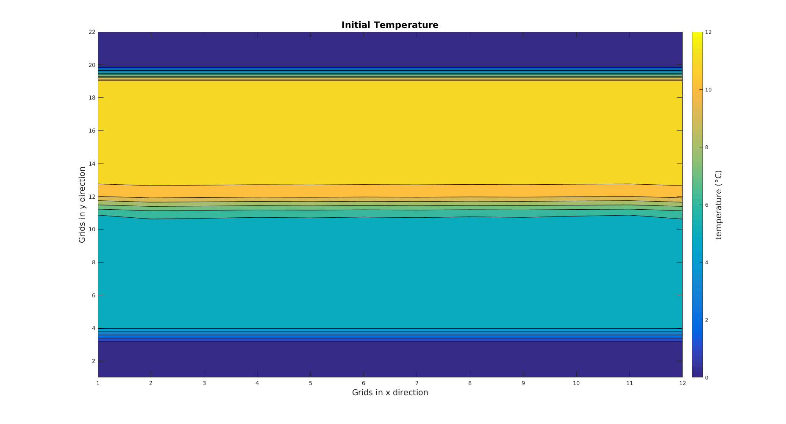
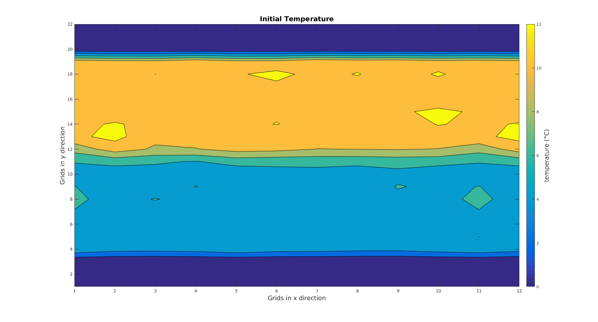
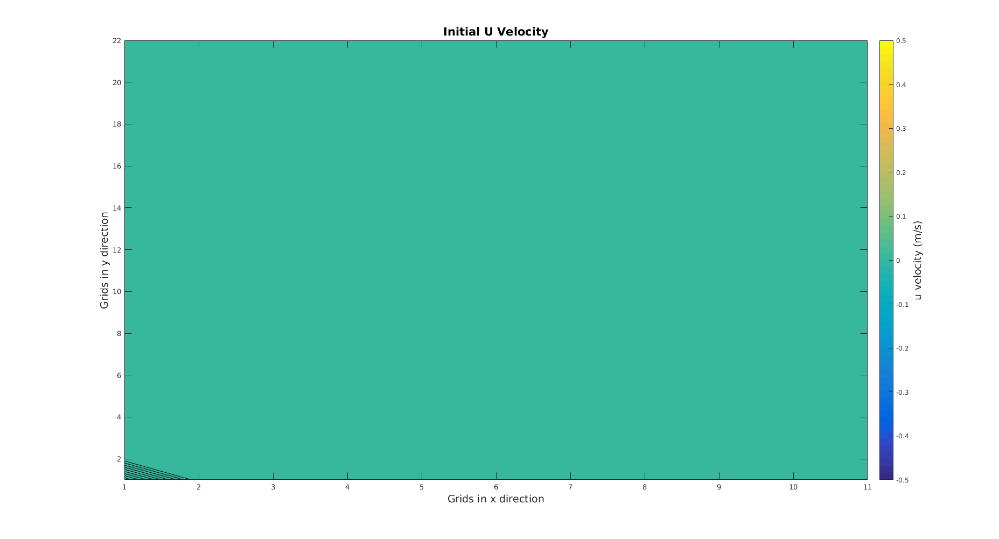
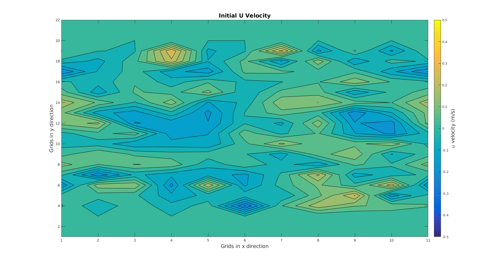
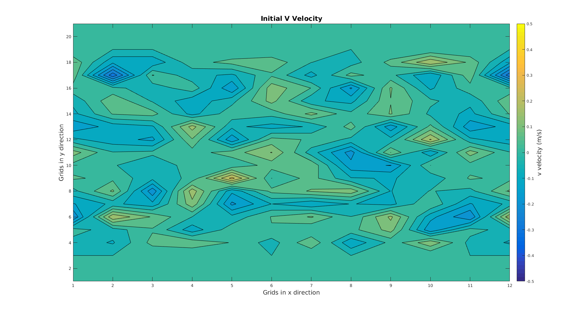
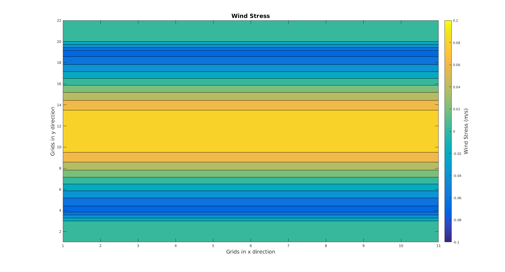
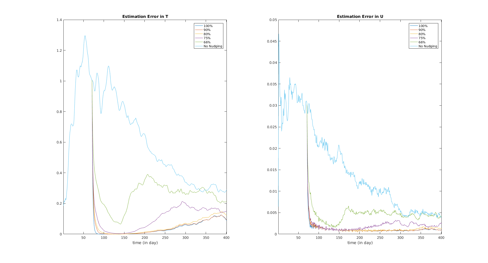

## Simple Nudging with ROMS on a system with smaller size

### Setup of twin experiments

In order to achieve faster computing time, we shall now start with a smaller system. The initial conditions for twin experiments are shown below. A Gaussian noise ($\mu = 0, \sigma = 0.1$ for velocity and $\sigma = 0.5$ for temperature)was added to the syestem shown as the second graph.

The wind force added has the form $\tau_u (i,j) = -0.1cos(2\pi y(i,j)/L)\space m^2/s^2$, where i,j are the index of grid points in x and y directions respectively, L is the total length in y direction, and subscript u indicates that the wind force is in x direction. The boundary conditions are periodical for y direction and closed for x direction. The bottom is flat. The other relevant parameters are listed below, as well as a plot for the wind stress.

| name                                | Description                             |Value             |
| ----------------------------------- | --------------------------------------- |------------------|
| $N_i$                               | Number of x direction $\rho$ points     |20                |
| $N_j$                               | Number of y direction $\rho$ points     |10                |
| $N_\sigma$                          | Number of vertical layers               |5                 |
| $dt$                                | Time step size                          |600s (10 min)     |
| $N_{time}$                          | Number of time steps                    |57600 (400 days)  |
| $N_{his}$                           | Number of time steps between observation|144 (1 day)       |
| $Zo_b$                              | Bottom Roughness                        |0.02m             |
| $\theta_s$                          | See Vertical S-coordinate section       |7                 |
| $\theta_b$                          | See Vertical S-coordinate section       |0.1               |

\
The total number of unknown variables are: 20x10x5x3(u, v, and temperature)+20x10($\zeta$) = 3200.

### Simple Nudging results

From day 71 to day 140, we applied simple nudging to the system as the first graph, trying to nudge it to the system with Gaussian noises added. After that, we run both systems without nudging until day 400, and compare the two systems. Below is a plot of estimation error vs time, which is defined as

$$
Estimation \space Error = \frac{1}{N_iN_jN_\sigma}\sum_{over\space all\space grids} (x_i^2-y_i^2)
$$

The results are plotted below.

\
From the graph, we can see that we roughly need around 75%-80% of the variables observed to have a good prediction. Next thing we want to do is to increase the forcing and see how the system behaves, and if we get similar result with simple nudging or not.
